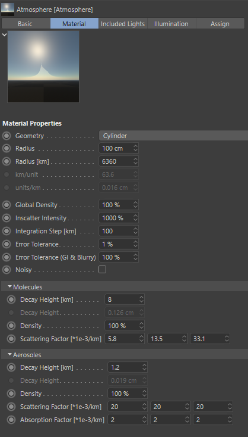

Atmosphere Material Plugin
==========================

This repository contains the sources for a material plugin for the 3D graphics software Cinema4D. It renders realistic atmospheric scattering.

This is the latest state from 2023. I did not check if the included code works. Things might be missing or broken. Just to be transparent. It probably needs changes if you want to use it with the current Cinema4D. Beware, the addition of additional geometries (ringworld etc.) is very new, so there might be issues as well.

